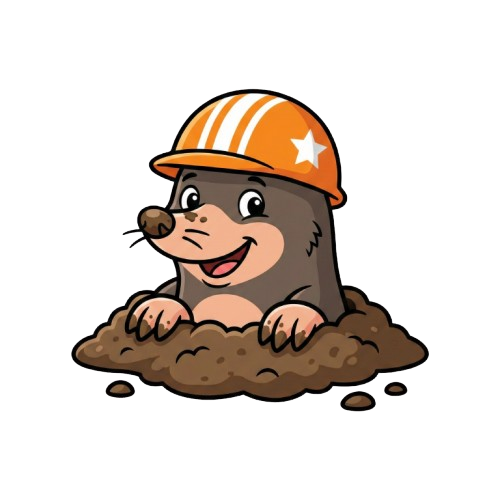

# Mole

<p align="center">
  
</p>

> The missing TUI for ngrok

Mole is a terminal-based user interface for monitoring and debugging ngrok traffic. Stop context-switching to your browser — inspect webhooks, replay requests, and debug APIs without leaving your terminal.

<p align="center">
  
</p>

## ✨ Features

### Core Features
- **Real-time traffic monitoring** — Watch HTTP requests flow through your ngrok tunnel
- **Request inspection** — View headers and body with JSON syntax highlighting
- **Responsive layout** — Adapts to your terminal size automatically

### Request Management
- **Replay requests** — Re-send any captured request with a single keystroke (`r`)
- **Replay with edit** — Modify method, path, headers, or body before replaying (`R`)
- **Diff view** — Compare two requests side-by-side to spot differences (`d`)
- **Copy as cURL** — Copy any request as a cURL command to clipboard (`c`)

### Search & Filter
- **Real-time search** — Search requests by path, method, or body content (`/`)
- **Advanced filtering** — Filter by status code, method, duration, path, and more (`f`)
  - Supports operators: `==`, `!=`, `>`, `<`, `>=`, `<=`, `match`, `!match`
  - Chain multiple filters with `&&` (AND) or `||` (OR)

### History & Persistence
- **Session history** — Browse and search past sessions (`h`)
- **Persistent storage** — All requests are saved to local SQLite database

### Navigation
- **Vim-style keybindings** — Navigate with `j`/`k`, `g`/`G`, and other familiar keys
- **Panel switching** — Toggle between list and detail panels with `Tab`
- **Scrollable detail view** — Scroll through large request/response bodies

## 📦 Installation

### From Source

```bash
git clone https://github.com/sung01299/mole.git
cd mole
make build
make install
```

### Using go install

```bash
go install github.com/sung01299/mole@latest
```

> **Note**: If `mole` command is not found after installation, add Go bin to your PATH:
> ```bash
> # For zsh (macOS default)
> echo 'export PATH="$HOME/go/bin:$PATH"' >> ~/.zshrc
> source ~/.zshrc
>
> # For bash
> echo 'export PATH="$HOME/go/bin:$PATH"' >> ~/.bashrc
> source ~/.bashrc
> ```

## 🚀 Usage

1. Start ngrok in one terminal:

```bash
ngrok http 8080
```

2. Run mole in another terminal:

```bash
mole
```

## ⌨️ Keybindings

### Navigation
| Key | Action |
|-----|--------|
| `j` / `↓` | Move down |
| `k` / `↑` | Move up |
| `g` / `Home` | Go to first item |
| `G` / `End` | Go to last item |
| `Tab` | Switch between list and detail panel |
| `Enter` | Confirm / Expand |
| `Esc` | Back / Cancel |

### Actions
| Key | Action |
|-----|--------|
| `/` | Search requests |
| `f` | Filter requests |
| `r` | Replay selected request |
| `R` | Replay with edit (modify before sending) |
| `c` | Copy request as cURL command |
| `d` | Diff mode (compare two requests) |
| `h` | View session history |

### Application
| Key | Action |
|-----|--------|
| `q` / `Ctrl+c` | Quit |

## ⚙️ Configuration

Mole connects to ngrok's local API at `http://127.0.0.1:4040` by default. You can override this with the `NGROK_API_URL` environment variable:

```bash
NGROK_API_URL=http://localhost:4041 mole
```

### Data Storage

Mole stores request history in a SQLite database at:
- **macOS/Linux**: `~/.mole/history.db`

## 📄 License

MIT
